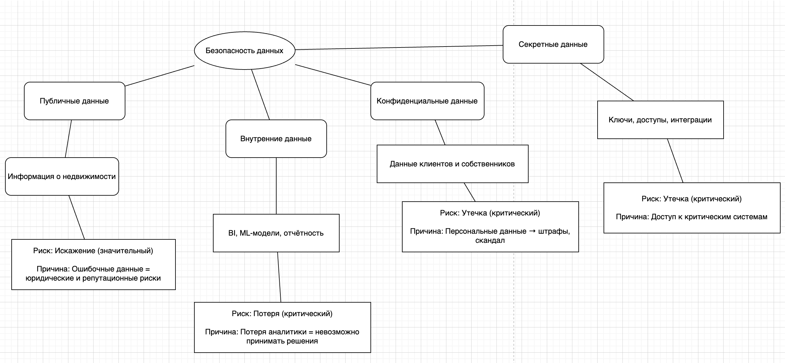

# Задание 1

### Подзадача 1

| Классификация | Данные |
|-----------|-----------|
|    публичные        |     Витрина с недвижимостью, промо-материалы      |
|    внутренние       |     BI-данные, ML-модели, внутренняя отчётность, справочники, логи операций  |
|    конфиденциальные |     Персональные данные клиентов и собственников, история сделок, данные об оплатах     |
|    секретные        |    административный доступ к БД и системам, ключи, учётные записи админов     |

### Определение рисков по категориям данных

| Категория данных       | Тип данных                                                              | Риски                            | Оценка риска     | Обоснование                                                                                   |
|------------------------|-------------------------------------------------------------------------|----------------------------------|------------------|-----------------------------------------------------------------------------------------------|
| **Публичные данные**   | Информация о недвижимости (описание, цены, планировки)                  | Искажение                        | Значительный     | Ошибочные данные могут ввести клиента в заблуждение, повлечь юридические и репутационные риски |
|                        |                                                                         | Обесценивание                    | Незначительный   | Неактуальные или устаревшие данные снижают доверие клиентов                                   |
| **Внутренние данные**  | BI-аналитика, ML-модели, отчётность, справочники                        | Утечка                           | Значительный     | Потенциальная потеря конкурентного преимущества                                                |
|                        |                                                                         | Потеря                           | Критический      | Без отчётности невозможно принимать управленческие решения                                    |
| **Конфиденциальные**   | Персональные данные клиентов и собственников, данные об оплате          | Утечка                           | Критический      | Нарушение закона, репутационные потери, возможные штрафы и судебные иски                      |
|                        |                                                                         | Искажение                        | Значительный     | Ошибки в ФИО, адресе и др. могут привести к ошибочным операциям и жалобам клиентов            |
|                        |                                                                         | Некачественные данные            | Значительный     | Недостоверная информация мешает обслуживанию, вызывает недовольство                          |
| **Секретные данные**   | Доступы, ключи, учётные записи                | Утечка                           | Критический      | Компрометация может привести к захвату инфраструктуры                                         |
|                        |                                                                         | Потеря                           | Значительный     | Потеря ключей или учёток может заблокировать работу систем                                    |

### Midemap
