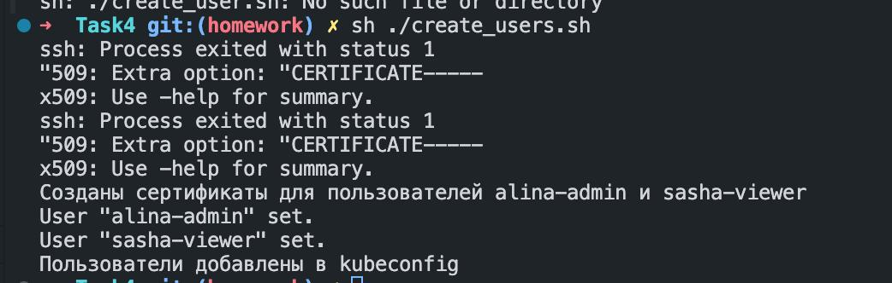
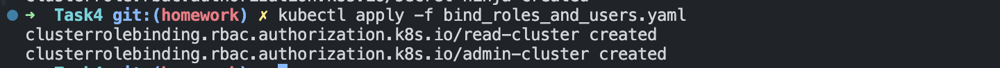
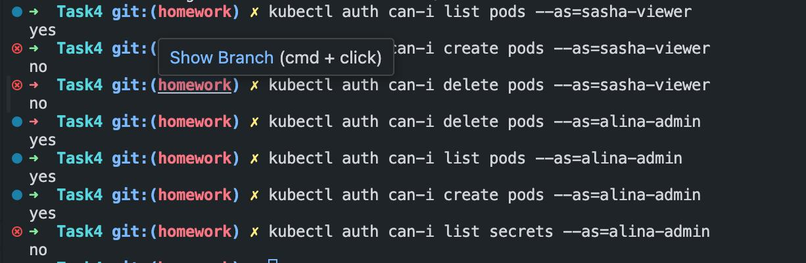

| № | Роль | Полномочия в Kubernetes | Группы пользователей |
|---|------|-------------------------|----------------------|
| 1 | Cluster-reader     | есть право только на просмотр ресурсов кластера | readers |
| 2 |  Cluster-admin | может настраивать кластер  | admins  |
| 3 |   Secret-ninja   | просмотр и настройка секретов и тд  | ninja  |

## Создание пользователей

.. потом создание ролей

## Привязка пользователей к ролям

## Проверка прав

Алина - админ кластера

Саша - имеет права только на просмотр ресурсов